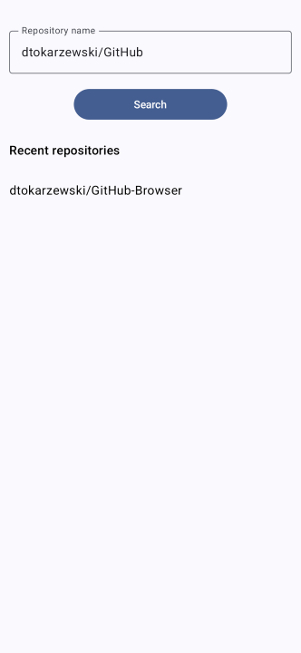
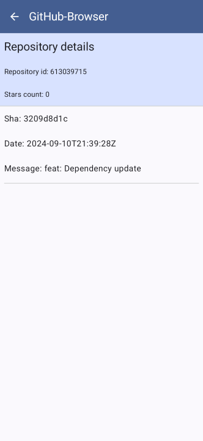

GitHub Browser
===========================================================
**work in progress**

This project is sample offline-first, redux-style Android app. It's purpose is to be a
playground for testing various architecture solutions and new libraries.

Introduction
-------------
 

### Functionality
The app is very basic GitHub browser. It allows you to search for GitHub repos and see it's details
and commits list in details screen.

### Building
No special operations needed - just run project in Android Studio.

### Testing
* Unit tests - UseCase and ViewModel unit tests for domain layer verification.
* Instrumentation tests - Right now project has couple of basic instrumentation tests verifying app navigation with Jetpack Compose
* Screenshot tests - experimental Compose Screenshot library was used to perform screenshot tests.

TODO: Add abstraction layer in UseCases for ViewModels isolation. Providing fake UseCase allow to not relay on fake repos in ViewModels tests. 
TODO: Add mappers unit tests

### Tech stack
Project follows Google's architecture recommendations and uses Architecture Components. Here are main
components/libraries used:

* Jetpack (with Compose)
* Material Design 3
* Kotlin Coroutines with FLow
* Kotlin Serialization
* Room
* Hilt
* Retrofit
* OkHttp

## Architecture
Project have multi-module architecture. It's an overkill to make such complex architecture for such
a small project, but it's goal was to make it as if it was big commercial project.

It consists of following layers:

#### Core
All `core:` modules contains classes used across the app.

#### Data layer
Offline first source of data in the app - all data fetched from network is saved in database. UI and
domain layers get data from database - never from network directly.

* `data:network` module fetches data from GitHub sever
* `data:database` module stores data in Room database
* `data` module orchestrates fetching, storing and mapping data from previous two
* `data:model` module stores data models used by business and ui layers. For proper layers separation 
* `data:network` and `data:database` modules have their own equivalent of those models.

#### Domain layer
Place for business logic represented by `UseCase`-s.

#### UI layer
* UI elements build using `Jetpack Compose`
* `ViewModel`-s
* Stored in `feature:xxx` modules

## TODO
* Add GitHub authorization
* Consider splitting domain and data modules into `feature` modules
* Write Repositories tests
* Configure CI
* Add some styling
* Configure GradleDependencyUpdate plugin
* Try SideEffectMviViewModel - in separate branch